# 🐶 Project Watchdog: The Ghost Recon Pipeline

> "Recon shouldn't take your time. It should take the target's peace of mind."

Project Watchdog is a **fully automated, cloud-native reconnaissance engine**. It orchestrates temporary AWS Spot instances to perform high-compute scans, processes the logs, and uses an **AI Attack Path Analyzer** to tell you exactly how to breach the target. 

It doesn’t just scan; it thinks.

---

## ⚡ The "Watchdog" Workflow

```mermaid
graph LR
    A[🎯 Webhook Trigger] --> B[🧠 n8n Controller]
    B --> C[☁️ AWS Spot Fleet]
    C --> D[🛠️ Parallel Recon: Subfinder/Nuclei/Nmap]
    D --> E[📦 S3 Data Dump]
    E --> F[🤖 AI Attack Path Analyzer]
    F --> G[📝 Final Report: docs/reports/]
    G --> H[🐚 Self-Destruct: Worker Terminated]
    
    style C fill:#f96,stroke:#333,stroke-width:2px
    style F fill:#69f,stroke:#333,stroke-width:2px
    style H fill:#f66,stroke:#333,stroke-width:2px
```



---

## 🚀 Why Watchdog?

* **Ghost Infrastructure:** Launches **Golden AMIs** on AWS Spot instances. They scan and then commit digital suicide (`shutdown -h now`) to save costs and leave no trace.
* **AI-Powered Lethality:** Uses a custom **Red-Team Swagger** prompt (OpenRouter/Gemini) to turn messy Nmap/Nikto logs into a prioritized Kill Chain.
* **Infinite Scalability:** Trigger 1 or 100 scans via a simple REST API/Webhook.
* **Persistence:** Automatically syncs results to your local NAS or Raspberry Pi homelab.

---

## 🗂️ Repo Structure

```text
project-watchdog/
├─ workflows/          # The n8n "Brain" (.json blueprints)
├─ aws-config/         # C2 Scripts (aws-scan, recon-worker.sh)
├─ docs/               # The "Hitman" Setup Guide
├─ examples/           # Sample AI-generated "Kill Chain" reports
└─ README.md           # You are here.
```

---

## ⚙️ Core Mechanics

1.  **The Trigger:** A POST request to `/scan?target=example.com`.
2.  **The Muscle:** n8n SSH's into your C2, which boots a pre-configured AWS Worker.
3.  **The Extraction:** Worker uploads a compressed `.zip` of Nmap, Nikto, and Nuclei results to S3.
4.  **The Intelligence:** n8n pulls the logs, feeds them to the **Attack Path Analyzer**, and generates a Markdown report with a Mermaid topology map.
5.  **The Clean-up:** The AWS Worker terminates. Total cost per scan: ~$0.02.

---

## 🛠️ Requirements

* **n8n** (Self-hosted or Cloud)
* **AWS Account** (For the Spot Instance fleet)
* **OpenRouter or Gemini API Key** (For the "Watchdog Brain")
* **A hunger for automation.**

---

## 📄 Documentation

Ready to deploy? Follow the **[Actually Human-Friendly Setup Guide](docs/instructions.md)**.

---

## 📌 Disclaimer
*Project Watchdog is for authorized security auditing and educational purposes only. Don't be a villain; be a Watchdog.*

---
**Status:** In Active Development 🛠️ | **Goal:** Project WatchGOD
